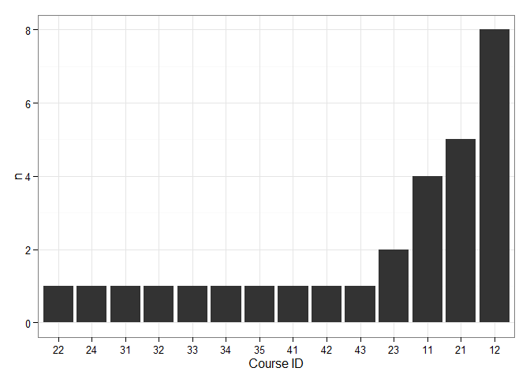
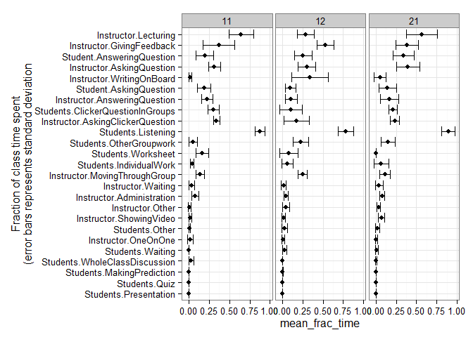
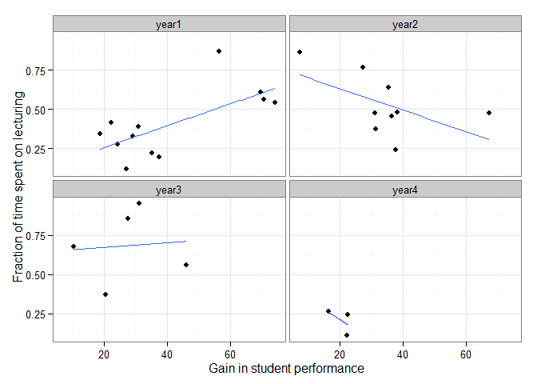

# Final_Analysis.Rmd
Tony Hui  
October 24, 2015  

# Prelimary analysis of the Data

## Load dependencies


```r
require(knitr)
```

```
## Loading required package: knitr
```

```r
opts_chunk$set(echo=F)
```


## Load data


### Sneak peak at the data


```
## [1] 31
```

```
##  [1] 16 17 18 19 20 21 22 23 24 25 33 34 35 36 37 38 39 40
```

Number of rows/columns all over the place - assume that there should only be 26 "real" columns (plus the 4 columns of metadata that was added) - use this function to figure out what's wrong.


### Issue fixed - went back and fixed the read file function and combined all data


| time| Students.Listening| Students.IndividualWork| Students.ClickerQuestionInGroups| Students.Worksheet| Students.OtherGroupwork| Student.AnsweringQuestion| Student.AskingQuestion| Students.WholeClassDiscussion| Students.MakingPrediction| Students.Presentation| Students.Quiz| Students.Waiting| Students.Other| Instructor.Lecturing| Instructor.WritingOnBoard| Instructor.GivingFeedback| Instructor.AskingQuestion| Instructor.AskingClickerQuestion| Instructor.AnsweringQuestion| Instructor.MovingThroughGroup| Instructor.OneOnOne| Instructor.ShowingVideo| Instructor.Administration| Instructor.Waiting| Instructor.Other|course |instructor |semester |observation |year |
|----:|------------------:|-----------------------:|--------------------------------:|------------------:|-----------------------:|-------------------------:|----------------------:|-----------------------------:|-------------------------:|---------------------:|-------------:|----------------:|--------------:|--------------------:|-------------------------:|-------------------------:|-------------------------:|--------------------------------:|----------------------------:|-----------------------------:|-------------------:|-----------------------:|-------------------------:|------------------:|----------------:|:------|:----------|:--------|:-----------|:----|
|    2|                  1|                       0|                                1|                  0|                       0|                         0|                      0|                             0|                         0|                     0|             0|                0|              0|                    0|                         0|                         1|                         1|                                1|                            0|                             0|                   0|                       0|                         0|                  0|                0|11     |A          |1        |1           |1    |
|    4|                  0|                       0|                                1|                  0|                       0|                         0|                      0|                             0|                         0|                     0|             0|                0|              0|                    0|                         0|                         0|                         1|                                0|                            0|                             0|                   0|                       0|                         0|                  0|                0|11     |A          |1        |1           |1    |
|    6|                  1|                       0|                                1|                  0|                       0|                         0|                      0|                             0|                         0|                     0|             0|                0|              0|                    1|                         0|                         1|                         1|                                1|                            0|                             0|                   0|                       0|                         0|                  0|                0|11     |A          |1        |1           |1    |
|    8|                  0|                       0|                                1|                  0|                       0|                         0|                      0|                             0|                         0|                     0|             0|                0|              0|                    0|                         0|                         1|                         0|                                1|                            0|                             0|                   0|                       0|                         0|                  0|                0|11     |A          |1        |1           |1    |
|   10|                  1|                       0|                                0|                  0|                       0|                         0|                      1|                             0|                         0|                     0|             0|                0|              0|                    0|                         0|                         1|                         0|                                0|                            1|                             0|                   0|                       0|                         0|                  0|                0|11     |A          |1        |1           |1    |
|   12|                  1|                       0|                                0|                  1|                       0|                         0|                      0|                             0|                         0|                     0|             0|                0|              0|                    0|                         0|                         1|                         1|                                0|                            0|                             0|                   0|                       0|                         0|                  0|                0|11     |A          |1        |1           |1    |

### Merge in class performance levels

#### Read in the file


|course |instructor |semester | StudentPerformance.SectionAverage| StudentPerformance.StandardError|ClassSize     |
|:------|:----------|:--------|---------------------------------:|--------------------------------:|:-------------|
|11     |A          |1        |                          74.09648|                         1.853726|More than 200 |
|11     |B          |1        |                          56.49132|                         3.643105|More than 200 |
|11     |C          |1        |                          70.73516|                         2.167993|More than 200 |
|11     |D          |1        |                          69.68558|                         1.855365|More than 200 |
|12     |E          |2        |                          29.07547|                         3.354000|More than 200 |
|12     |H          |2        |                          22.28033|                         3.297568|More than 200 |

#### Merge with the rest


```
## Joining by: c("course", "instructor", "semester")
```

# Basic exploratory analysis

## Fractional amount of time spent on each category overall

 

## Fractional amount of time spent on each category overall per year

 

## Fractional amount of time spent on each category for all courses in 1st year, further granuarized by instructor

The labels in each box represents the course

 

# Question 1: Which activities (individually) has an effect on student performance?

## Plot the variation of each measure for `course 11` between instructors-semester pairings

It really doesn't make sense to look across courses since different courses have different content = different methods of learning - scientific method: only vary one variable at a time.

 

## Plot correlation between the top 3 variable activities

 

## Time spent on lecture vs student growth

All courses - each dot is one course (separated by year level)

 

Looks like there's a positive correlation with lecture time and student performance in first year classes, and a negative correlation in second year classes

# Question 2: Quantifying transitions in class "states"

Looking only at 

## Time spent on lecture vs student growth


