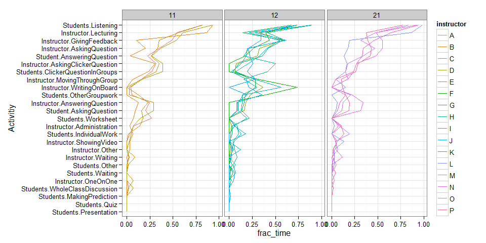
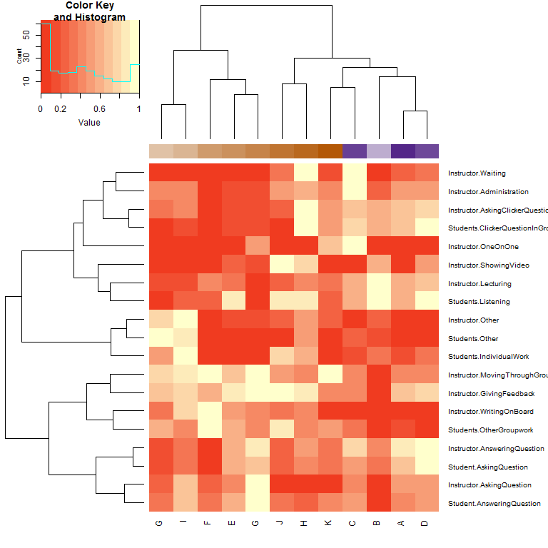

# Final_Analysis.Rmd
Tony Hui  
October 24, 2015  

# Introduction to us

## Team Members

* Tony Hui - MSc student in Genome Sciences
    + http://makedatasense.ca/
    + https://ca.linkedin.com/in/huitonyzk
* Tyler Robb-smith - Physics PhD graduate
* Nathan Roberson - Statistics PhD graduate
    + https://www.linkedin.com/in/nathandroberson
* Renee Mak - Freelance graphic designer
    + http://reneemak.com

# Prelimary analysis of the Data

## Load dependencies and Data


```r
require(knitr)
```

```
## Loading required package: knitr
```

```r
opts_chunk$set(echo=F)
```


### Sneak peak at the data


```
## [1] 31
```

```
##  [1] 16 17 18 19 20 21 22 23 24 25 33 34 35 36 37 38 39 40
```

Number of rows/columns all over the place - assume that there should only be 26 "real" columns (plus the 4 columns of metadata that was added) - use this function to figure out what's wrong.


### Issue fixed - went back and fixed the read file function and combined all data


| time| Students.Listening| Students.IndividualWork| Students.ClickerQuestionInGroups| Students.Worksheet| Students.OtherGroupwork| Student.AnsweringQuestion| Student.AskingQuestion| Students.WholeClassDiscussion| Students.MakingPrediction| Students.Presentation| Students.Quiz| Students.Waiting| Students.Other| Instructor.Lecturing| Instructor.WritingOnBoard| Instructor.GivingFeedback| Instructor.AskingQuestion| Instructor.AskingClickerQuestion| Instructor.AnsweringQuestion| Instructor.MovingThroughGroup| Instructor.OneOnOne| Instructor.ShowingVideo| Instructor.Administration| Instructor.Waiting| Instructor.Other|course |instructor |semester |observation |year |
|----:|------------------:|-----------------------:|--------------------------------:|------------------:|-----------------------:|-------------------------:|----------------------:|-----------------------------:|-------------------------:|---------------------:|-------------:|----------------:|--------------:|--------------------:|-------------------------:|-------------------------:|-------------------------:|--------------------------------:|----------------------------:|-----------------------------:|-------------------:|-----------------------:|-------------------------:|------------------:|----------------:|:------|:----------|:--------|:-----------|:----|
|    2|                  1|                       0|                                1|                  0|                       0|                         0|                      0|                             0|                         0|                     0|             0|                0|              0|                    0|                         0|                         1|                         1|                                1|                            0|                             0|                   0|                       0|                         0|                  0|                0|11     |A          |1        |1           |1    |
|    4|                  0|                       0|                                1|                  0|                       0|                         0|                      0|                             0|                         0|                     0|             0|                0|              0|                    0|                         0|                         0|                         1|                                0|                            0|                             0|                   0|                       0|                         0|                  0|                0|11     |A          |1        |1           |1    |
|    6|                  1|                       0|                                1|                  0|                       0|                         0|                      0|                             0|                         0|                     0|             0|                0|              0|                    1|                         0|                         1|                         1|                                1|                            0|                             0|                   0|                       0|                         0|                  0|                0|11     |A          |1        |1           |1    |
|    8|                  0|                       0|                                1|                  0|                       0|                         0|                      0|                             0|                         0|                     0|             0|                0|              0|                    0|                         0|                         1|                         0|                                1|                            0|                             0|                   0|                       0|                         0|                  0|                0|11     |A          |1        |1           |1    |
|   10|                  1|                       0|                                0|                  0|                       0|                         0|                      1|                             0|                         0|                     0|             0|                0|              0|                    0|                         0|                         1|                         0|                                0|                            1|                             0|                   0|                       0|                         0|                  0|                0|11     |A          |1        |1           |1    |
|   12|                  1|                       0|                                0|                  1|                       0|                         0|                      0|                             0|                         0|                     0|             0|                0|              0|                    0|                         0|                         1|                         1|                                0|                            0|                             0|                   0|                       0|                         0|                  0|                0|11     |A          |1        |1           |1    |

### Merge in class performance levels

#### Read in the file


|course |instructor |semester | StudentPerformance.SectionAverage| StudentPerformance.StandardError|ClassSize     |
|:------|:----------|:--------|---------------------------------:|--------------------------------:|:-------------|
|11     |A          |1        |                          74.09648|                         1.853726|More than 200 |
|11     |B          |1        |                          56.49132|                         3.643105|More than 200 |
|11     |C          |1        |                          70.73516|                         2.167993|More than 200 |
|11     |D          |1        |                          69.68558|                         1.855365|More than 200 |
|12     |E          |2        |                          29.07547|                         3.354000|More than 200 |
|12     |H          |2        |                          22.28033|                         3.297568|More than 200 |

#### Merge with the rest


```
## Joining by: c("course", "instructor", "semester")
```

# Basic exploratory analysis

## Fractional amount of time spent on each category overall

 

## Fractional amount of time spent on each category overall per class year

 

## Number of different instructor-semester pairings per course

 

## Fractional amount of time spent on each category for course `12`, `21`, and `11`, further granuarized by instructor

The labels in each box represents the course id

 


## Time spent on lecture vs student growth

All courses - each dot is one course (separated by year level)

 

Looks like there's a positive correlation with lecture time and student performance in first year classes, and a negative correlation in second year classes

# Question 1: Which activities (individually) has an effect on student performance?

## Plot the variation of each measure for a single course and compare across instructors-semester pairings

It really doesn't make sense to look across courses since different courses have different content = different methods of learning - scientific method: only vary one variable at a time.

### Plot the variation of each measure for course 12 between instructors-semester pairings

 

## Plot correlation between the top activities with the highest variations


|course |measure                          | mean_frac_time| sd_frac_time|
|:------|:--------------------------------|--------------:|------------:|
|11     |Instructor.GivingFeedback        |      0.3695967|    0.1952960|
|11     |Instructor.Lecturing             |      0.6452251|    0.1506574|
|11     |Student.AnsweringQuestion        |      0.1984793|    0.1081545|
|12     |Instructor.WritingOnBoard        |      0.3414951|    0.2244159|
|12     |Instructor.AskingClickerQuestion |      0.1744882|    0.1548260|
|12     |Students.ClickerQuestionInGroups |      0.1053506|    0.1383469|
|21     |Instructor.Lecturing             |      0.5679053|    0.1919070|
|21     |Instructor.AskingQuestion        |      0.3937903|    0.1415409|
|21     |Instructor.GivingFeedback        |      0.3833762|    0.1373068|

```
## Joining by: c("course", "measure")
```

 


# Question 2: Which activities (individually) explains the largest variability in student performance across all courses?

### Multiple linear regression

#### Transform data for regression modelling


|course |instructor |semester | StudentPerformance.SectionAverage| StudentPerformance.StandardError| Students.Listening| Students.IndividualWork| Students.ClickerQuestionInGroups| Students.Worksheet| Students.OtherGroupwork| Student.AnsweringQuestion| Student.AskingQuestion| Students.WholeClassDiscussion| Students.MakingPrediction| Students.Presentation| Students.Quiz| Students.Waiting| Students.Other| Instructor.Lecturing| Instructor.WritingOnBoard| Instructor.GivingFeedback| Instructor.AskingQuestion| Instructor.AskingClickerQuestion| Instructor.AnsweringQuestion| Instructor.MovingThroughGroup| Instructor.OneOnOne| Instructor.ShowingVideo| Instructor.Administration| Instructor.Waiting| Instructor.Other|
|:------|:----------|:--------|---------------------------------:|--------------------------------:|------------------:|-----------------------:|--------------------------------:|------------------:|-----------------------:|-------------------------:|----------------------:|-----------------------------:|-------------------------:|---------------------:|-------------:|----------------:|--------------:|--------------------:|-------------------------:|-------------------------:|-------------------------:|--------------------------------:|----------------------------:|-----------------------------:|-------------------:|-----------------------:|-------------------------:|------------------:|----------------:|
|11     |A          |1        |                          74.09648|                         1.853726|          0.8191489|               0.0319149|                        0.2659574|          0.2659574|               0.0531915|                 0.2234043|              0.2021277|                     0.0212766|                         0|                     0|             0|        0.0000000|      0.0000000|            0.5425532|                 0.0425532|                 0.4893617|                 0.3510638|                        0.3191489|                    0.2446809|                     0.1595745|           0.0000000|               0.0000000|                 0.0744681|          0.0212766|        0.0000000|
|11     |B          |1        |                          56.49132|                         3.643105|          0.9296875|               0.0625000|                        0.2343750|          0.0703125|               0.0000000|                 0.0390625|              0.0937500|                     0.0000000|                         0|                     0|             0|        0.0000000|      0.0078125|            0.8671875|                 0.0000000|                 0.1015625|                 0.2031250|                        0.3046875|                    0.1250000|                     0.0625000|           0.0000000|               0.0312500|                 0.0312500|          0.0000000|        0.0312500|
|11     |C          |1        |                          70.73516|                         2.167993|          0.8245614|               0.0175439|                        0.3157895|          0.1754386|               0.1228070|                 0.2631579|              0.1578947|                     0.0175439|                         0|                     0|             0|        0.0000000|      0.0175439|            0.5614035|                 0.0000000|                 0.3508772|                 0.3333333|                        0.3508772|                    0.2280702|                     0.1578947|           0.0701754|               0.0000000|                 0.1403509|          0.0877193|        0.0000000|
|11     |D          |1        |                          69.68558|                         1.855365|          0.9268293|               0.0487805|                        0.3902439|          0.1463415|               0.0243902|                 0.2682927|              0.2926829|                     0.0731707|                         0|                     0|             0|        0.0000000|      0.0000000|            0.6097561|                 0.0243902|                 0.5365854|                 0.3658537|                        0.3902439|                    0.2926829|                     0.1707317|           0.0000000|               0.0243902|                 0.0731707|          0.0243902|        0.0000000|
|12     |E          |2        |                          29.07547|                         3.354000|          0.8860759|               0.0126582|                        0.0632911|          0.0000000|               0.2278481|                 0.3037975|              0.1645570|                     0.0000000|                         0|                     0|             0|        0.0126582|      0.0000000|            0.3291139|                 0.3670886|                 0.5822785|                 0.3291139|                        0.0759494|                    0.1772152|                     0.2278481|           0.0000000|               0.0126582|                 0.0253165|          0.0000000|        0.0126582|
|12     |F          |1        |                          30.92110|                         2.152980|          0.7391304|               0.0000000|                        0.0000000|          0.0000000|               0.3913043|                 0.1739130|              0.0000000|                     0.0000000|                         0|                     0|             0|        0.0434783|      0.0000000|            0.3913043|                 0.7391304|                 0.4347826|                 0.2608696|                        0.0000000|                    0.0000000|                     0.3043478|           0.0000000|               0.0000000|                 0.0000000|          0.0000000|        0.0000000|

#### Predicting student performance as a function of all our variables


```
## 
## Call:
## glm(formula = as.formula(paste("StudentPerformance.SectionAverage ~ ", 
##     paste(predicting_variables, collapse = "+"))), data = summary_of_fract_time_spent %>% 
##     filter(course %in% course_of_interest))
## 
## Deviance Residuals: 
##        1         2         3         4         5         6         7  
##   5.7483   -1.4791   -0.5680    1.3046   10.5502   -1.3201  -11.2178  
##        8         9        10        11        12        13        14  
##   0.8430   -9.9266   -1.0082    0.0000    5.1354    3.9986    0.5431  
##       15        16        17        18        19        20        21  
##  -0.0432   -2.2485    2.6452    4.2951    6.1347    0.2047   -1.5641  
##       22        23        24        25        26        27        28  
##  -3.2359   -2.1277   -3.4388   -1.2596   -0.9935    0.1328    0.0000  
##       29  
##  -1.1046  
## 
## Coefficients:
##                                  Estimate Std. Error t value Pr(>|t|)  
## (Intercept)                        253.47     205.69   1.232   0.3056  
## Students.Listening                 -44.40     230.58  -0.193   0.8596  
## Students.IndividualWork           -139.89     176.56  -0.792   0.4860  
## Students.ClickerQuestionInGroups   792.45     329.63   2.404   0.0955 .
## Students.Worksheet                  31.75     250.38   0.127   0.9071  
## Students.OtherGroupwork            -69.02     165.50  -0.417   0.7047  
## Student.AnsweringQuestion         -309.31     219.27  -1.411   0.2532  
## Student.AskingQuestion            -317.43     439.16  -0.723   0.5220  
## Students.WholeClassDiscussion      145.52     282.89   0.514   0.6425  
## Students.MakingPrediction         6810.25    3566.51   1.910   0.1522  
## Students.Presentation             -947.95     548.66  -1.728   0.1825  
## Students.Quiz                     3257.68    2261.38   1.441   0.2453  
## Students.Waiting                  -288.71     355.73  -0.812   0.4764  
## Students.Other                    -262.65     348.58  -0.754   0.5059  
## Instructor.Lecturing              -199.13     177.28  -1.123   0.3431  
## Instructor.WritingOnBoard           31.34      37.98   0.825   0.4697  
## Instructor.GivingFeedback         -299.92     204.20  -1.469   0.2382  
## Instructor.AskingQuestion          137.25     146.89   0.934   0.4190  
## Instructor.AskingClickerQuestion  -753.46     313.78  -2.401   0.0958 .
## Instructor.AnsweringQuestion       585.81     482.06   1.215   0.3112  
## Instructor.MovingThroughGroup      178.38     130.10   1.371   0.2639  
## Instructor.OneOnOne              -1358.92     630.40  -2.156   0.1201  
## Instructor.ShowingVideo           -255.38     198.15  -1.289   0.2879  
## Instructor.Administration          421.68     296.69   1.421   0.2504  
## Instructor.Waiting                 606.32     301.12   2.014   0.1375  
## Instructor.Other                   822.82     476.23   1.728   0.1825  
## ---
## Signif. codes:  0 '***' 0.001 '**' 0.01 '*' 0.05 '.' 0.1 ' ' 1
## 
## (Dispersion parameter for gaussian family taken to be 173.4413)
## 
##     Null deviance: 8695.36  on 28  degrees of freedom
## Residual deviance:  520.32  on  3  degrees of freedom
## AIC: 220.03
## 
## Number of Fisher Scoring iterations: 2
```

#### Take only the dimensions that are significant (top 6)


|id                               |   estimate|    stderr|      tval|      pval|
|:--------------------------------|----------:|---------:|---------:|---------:|
|Students.ClickerQuestionInGroups |   792.4511|  329.6340|  2.404033| 0.0955275|
|Instructor.AskingClickerQuestion |  -753.4640|  313.7805| -2.401246| 0.0957672|
|Instructor.OneOnOne              | -1358.9201|  630.4000| -2.155647| 0.1200670|
|Instructor.Waiting               |   606.3203|  301.1180|  2.013564| 0.1375088|
|Students.MakingPrediction        |  6810.2533| 3566.5069|  1.909502| 0.1522005|
|Instructor.Other                 |   822.8232|  476.2320|  1.727778| 0.1824773|

#### Looking at how these variables predict student performance

 

Conclusion: cannot compare across courses

# Question 3 - which classes are arranged such that they have similar amounts of time spent on each activity?

## Focusing on course 12 for now


```
## Loading required package: gplots
## 
## Attaching package: 'gplots'
## 
## The following object is masked from 'package:stats':
## 
##     lowess
```


NOTE: The gradient labels represents the students performance, normalized between 0 to 1. Brown = low, purple = high (values normalized between 0 to 1)

 

## What about across all courses?


 

# Quantifying "chaos" - check if the activity profile changed between 2 minute blocks


